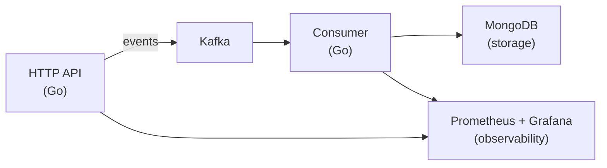

# 🔴 Pulse Pipeline

A hands-on learning project for **Go**, **Apache Kafka**, **MongoDB**, and **GCP** — a mini real-time event tracking pipeline built to explore distributed systems concepts.

## What is this?

Events flow in (page views, clicks, purchases), get validated, streamed through Kafka, and stored in MongoDB — all at high throughput with observability built in.



## Why?

Learning by building. This project covers:

- **Go** — HTTP servers, goroutines, channels, graceful shutdown, error handling
- **Apache Kafka** — producers, consumers, consumer groups, topics, partitions, offsets
- **MongoDB** — document storage, indexing, aggregation pipelines, bulk writes
- **Docker Compose** — multi-service local development
- **Observability** — Prometheus metrics, Grafana dashboards
- **GCP-ready** — Terraform configs for GKE, BigQuery, Cloud Storage (not deployed, just IaC)

## Quick Start

### Prerequisites

- [Go 1.26+](https://go.dev/dl/)
- [Docker](https://docs.docker.com/get-docker/) + Docker Compose
- [Make](https://www.gnu.org/software/make/) (optional, for convenience)

### Run everything locally

```bash
# Start the full stack (Kafka, MongoDB, Prometheus, Grafana, API, Consumer)
docker compose up -d

# Send a test event
curl -X POST http://localhost:8080/api/v1/track \
  -H "Content-Type: application/json" \
  -d '{
    "customer_id": "user-123",
    "event_type": "page_view",
    "properties": {
      "page": "/products/winter-jacket",
      "referrer": "google.com"
    }
  }'

# Check health
curl http://localhost:8080/health

# View metrics
open http://localhost:9090    # Prometheus
open http://localhost:3000    # Grafana (admin/admin)

# View events in MongoDB
docker compose exec mongodb mongosh --eval "db.events.find().sort({timestamp: -1}).limit(5)"

# Stop everything
docker compose down
```

### Run Go services locally (development)

```bash
# Start infrastructure only
docker compose up -d kafka mongodb prometheus grafana

# Run API server
cd services/api && go run .

# Run consumer (in another terminal)
cd services/consumer && go run .
```

## Project Structure

```
pulse-pipeline/
├── CLAUDE.md                  # Claude Code instructions
├── README.md                  # This file
├── docker-compose.yml         # Full local stack
├── Makefile                   # Convenience commands
├── docs/
│   └── PROJECT_SPEC.md        # Detailed project specification
├── services/
│   ├── api/                   # HTTP Tracking API (Go)
│   │   ├── main.go
│   │   ├── go.mod
│   │   ├── Dockerfile
│   │   ├── handlers/          # HTTP handlers
│   │   ├── middleware/        # Logging, metrics, recovery
│   │   ├── models/            # Event structs, validation
│   │   └── kafka/             # Kafka producer wrapper
│   └── consumer/              # Kafka Consumer (Go)
│       ├── main.go
│       ├── go.mod
│       ├── Dockerfile
│       ├── kafka/             # Kafka consumer wrapper
│       ├── mongodb/           # MongoDB writer (bulk, idempotent)
│       └── models/            # Shared event models
├── infra/
│   ├── terraform/             # GCP infrastructure as code
│   │   ├── main.tf
│   │   ├── variables.tf
│   │   ├── gke.tf             # Google Kubernetes Engine
│   │   ├── bigquery.tf        # BigQuery dataset + tables
│   │   ├── gcs.tf             # Cloud Storage buckets
│   │   └── monitoring.tf      # Cloud Monitoring alerts
│   └── k8s/                   # Kubernetes manifests
│       ├── api-deployment.yaml
│       ├── consumer-deployment.yaml
│       └── configmap.yaml
├── monitoring/
│   ├── prometheus/
│   │   └── prometheus.yml     # Scrape config
│   └── grafana/
│       ├── provisioning/      # Auto-provisioned dashboards
│       └── dashboards/
│           └── pipeline.json  # Pipeline metrics dashboard
├── scripts/
│   ├── load-test.sh           # Simple load testing with curl
│   └── seed-events.sh         # Seed sample events
└── .github/
    └── workflows/
        └── ci.yml             # Go test + lint + build
```

## Architecture

See `docs/PROJECT_SPEC.md` for the full specification including:

- Component architecture and data flow
- API contract and event schema
- Kafka topic design and partitioning strategy
- MongoDB schema and indexing
- Observability strategy (metrics, dashboards)
- GCP deployment architecture (Terraform)
- Implementation phases with acceptance criteria

## Tech Stack

| Component | Technology | Why |
|---|---|---|
| API Server | Go + net/http | High throughput, low latency, goroutines for concurrency |
| Event Streaming | Apache Kafka | Log-based, multi-consumer, replay capability, ordering |
| Storage | MongoDB | Flexible schema for events, good write throughput |
| Metrics | Prometheus | Pull-based, PromQL, de facto standard |
| Dashboards | Grafana | Visualization, alerting, dashboards as code |
| IaC | Terraform | GCP infrastructure definition (not deployed) |
| Containers | Docker + Docker Compose | Local development, reproducible environments |
| CI | GitHub Actions | Automated testing and linting |

## Commands

```bash
make up           # Start full stack
make down         # Stop full stack
make logs         # Tail all logs
make test         # Run all Go tests
make lint         # Run golangci-lint
make build        # Build Go binaries
make load-test    # Run load test (1000 events)
make seed         # Seed sample events
make clean        # Remove containers, volumes, binaries
```

## License

MIT — learning project, use as you wish.

---

**Author:** [Adam Žúrek](https://github.com/zurek11)
