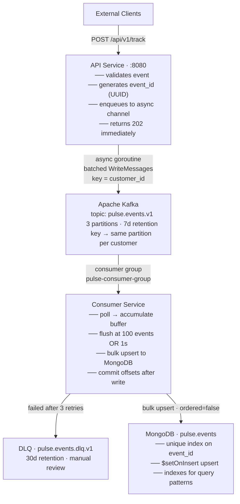
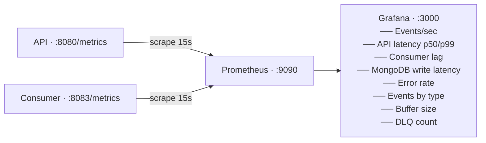

# 🔴 Pulse Pipeline

A real-time event tracking pipeline built to learn **Go**, **Apache Kafka**, **MongoDB**, and **GCP infrastructure** from scratch. Events flow from an HTTP API → Kafka → MongoDB with full observability and a Terraform-ready GCP deployment design.

> Built as a portfolio/learning project — not production software. Every decision was made deliberately to explore a concept, and the trade-offs are documented below.

---

## Table of Contents

- [What It Does](#what-it-does)
- [Architecture](#architecture)
- [How It Works](#how-it-works)
- [Key Design Decisions](#key-design-decisions)
- [GCP Deployment Design](#gcp-deployment-design)
- [Observability](#observability)
- [Load Test Results](#load-test-results)
- [Quick Start](#quick-start)
- [Project Structure](#project-structure)
- [Tech Stack](#tech-stack)
- [Commands](#commands)

---

## What It Does

Pulse Pipeline accepts HTTP tracking events (page views, clicks, purchases), validates and streams them through Kafka, and durably stores them in MongoDB — all observable via Prometheus and Grafana.

**Example event:**
```bash
curl -X POST http://localhost:8080/api/v1/track \
  -H "Content-Type: application/json" \
  -d '{
    "customer_id": "user-123",
    "event_type":  "purchase",
    "properties":  { "product": "winter-jacket", "price": 89.99 }
  }'
# → {"status":"accepted","event_id":"evt_a3f1..."}
```

---

## Architecture

### Data Flow



### Observability Flow



---

## How It Works

### API Service (`services/api`)

The API is a plain `net/http` server with no framework. It accepts single events (`POST /api/v1/track`) and batches (`POST /api/v1/track/batch`, max 100).

**Request lifecycle:**
1. Panic recovery middleware wraps every request
2. Request ID middleware generates a UUID, injects it into the context and logs
3. Metrics middleware records latency and status code
4. Handler validates the event (required fields, enum check, size limits)
5. If valid: `event_id` is generated (UUID v4 with `evt_` prefix), timestamp defaulted to now
6. Event is serialised to JSON and pushed onto an in-memory channel — **the HTTP handler returns 202 immediately**
7. A background goroutine drains the channel and writes to Kafka in natural batches

The async channel (capacity 10,000) is the key reason the load test achieves >9,000 events/sec with 0 errors — the HTTP response time is completely decoupled from Kafka write latency.

**Graceful shutdown:** on SIGINT/SIGTERM, the server stops accepting new connections, drains the Kafka channel, flushes the writer, then closes the MongoDB connection.

### Consumer Service (`services/consumer`)

The consumer runs a tight poll loop using a `segmentio/kafka-go` reader in consumer group mode.

**Flush strategy:**
- Events accumulate in an in-memory buffer
- Flush triggers when: buffer reaches 100 events **OR** 1 second has elapsed (whichever comes first)
- Flush = MongoDB bulk write (unordered, so one bad document doesn't block the rest) + Kafka offset commit
- Offsets are committed **only after** a successful MongoDB write — if the write fails, the consumer does not commit, so the messages will be redelivered (at-least-once semantics)

**Idempotency:**
Each MongoDB write is an upsert: `{ filter: { event_id: X }, update: { $setOnInsert: event }, upsert: true }`. If the same `event_id` arrives twice (Kafka redelivery), the second write matches the filter but `$setOnInsert` is a no-op — the document is not overwritten. This makes the consumer safe under at-least-once delivery.

**Dead Letter Queue:**
If a batch fails to write after 3 retries, the events are produced to `pulse.events.dlq.v1` (30-day retention) for manual inspection, and the original offsets are committed so the consumer moves forward.

---

## Key Design Decisions

See [`docs/decisions.md`](docs/decisions.md) for full rationale. Summary:

| Decision | Choice | Why |
|---|---|---|
| Kafka partition key | `customer_id` | All events for one customer land on the same partition → ordering guarantee per customer |
| Kafka client | `segmentio/kafka-go` | Pure Go, no CGo → simpler Docker builds than `confluent-kafka-go` |
| Kafka producer mode | Async (buffered channel) | Decouples HTTP latency from Kafka latency; eliminates WriteTimeout errors under load |
| MongoDB write strategy | Bulk upsert, `$setOnInsert` | Throughput (bulk) + idempotency (upsert) in one operation |
| Offset commit timing | After successful DB write | Guarantees at-least-once; no data loss if MongoDB is briefly unavailable |
| Metrics registry | Custom `prometheus.Registry` | Avoids collisions with default global registry in tests |
| HTTP framework | `net/http` stdlib only | Learning goal; sufficient for this workload |

---

## GCP Deployment Design

The `infra/` directory contains Terraform configs and Kubernetes manifests that describe how this pipeline would run on GCP. **Not deployed** — config only, `terraform validate` passes.

```
┌─────────────────────────────────────────────────────────────────┐
│                          GCP Project                            │
│                                                                 │
│  ┌────────────────────────────────────────────────────────┐    │
│  │               VPC: pulse-pipeline-vpc                  │    │
│  │                                                        │    │
│  │  ┌──────────────────────────────────────────────────┐  │    │
│  │  │          GKE Cluster  (europe-west1)             │  │    │
│  │  │     Regional · 3 zones · HA control plane        │  │    │
│  │  │                                                  │  │    │
│  │  │  ┌─────────────────┐   ┌──────────────────────┐  │  │    │
│  │  │  │   pulse-api     │   │   pulse-consumer     │  │  │    │
│  │  │  │   2–5 pods      │   │   1–3 pods           │  │  │    │
│  │  │  │   HPA @ 70% CPU │   │   1 pod / partition  │  │  │    │
│  │  │  │   LoadBalancer  │   │   ClusterIP only     │  │  │    │
│  │  │  └─────────────────┘   └──────────────────────┘  │  │    │
│  │  │                                                  │  │    │
│  │  │   Node pool: e2-standard-2 · autoscale 1–3       │  │    │
│  │  │   Workload Identity · auto-repair/upgrade        │  │    │
│  │  └──────────────────────────────────────────────────┘  │    │
│  │                                                        │    │
│  │   Cloud NAT  (egress without public node IPs)          │    │
│  └────────────────────────────────────────────────────────┘    │
│                                                                 │
│  ┌───────────────────────┐   ┌────────────────────────────┐    │
│  │  BigQuery             │   │  Cloud Storage             │    │
│  │  dataset: pulse_events│   │  pulse-pipeline-exports    │    │
│  │  partition by         │   │  versioning enabled        │    │
│  │    DATE(timestamp)    │   │  90-day lifecycle deletion │    │
│  │  cluster by           │   │  MongoDB → GCS → BQ flow   │    │
│  │    customer_id        │   └────────────────────────────┘    │
│  └───────────────────────┘                                      │
│                                                                 │
│  ┌────────────────────────────────────────────────────────┐    │
│  │  Cloud Monitoring                                      │    │
│  │  · Alert: API error rate > 5%  (5-min window)         │    │
│  │  · Alert: Consumer lag > 10k messages                 │    │
│  │  · Uptime check: GET /health every 60s                │    │
│  └────────────────────────────────────────────────────────┘    │
└─────────────────────────────────────────────────────────────────┘
```

**Key GCP choices:**
- **GKE over Cloud Run** — the consumer needs a persistent Kafka connection and stateful offset management; Cloud Run's ephemeral instances are a poor fit
- **BigQuery for analytics** — operational queries go to MongoDB; full-scan analytics (e.g. "all purchases last 30 days by region") go to BigQuery. Partitioning by date + clustering by `customer_id` means most queries scan only the relevant partitions
- **Cloud NAT** — nodes have no public IPs; all egress routes through NAT, reducing the attack surface
- **Workload Identity** — pods authenticate to GCP APIs via Kubernetes service accounts bound to GCP service accounts; no JSON key files anywhere

---

## Observability

Grafana dashboard is auto-provisioned on `docker compose up` — no manual setup needed.

**Open at:** http://localhost:3000 (admin / admin)

### Dashboard Screenshot

> 📸 _Run `docker compose up -d && make load-test` to see live data_


**8 panels:**

| Panel | Query | What to watch |
|---|---|---|
| Events/sec | `rate(pulse_api_events_produced_total[1m])` | Throughput — should track your send rate |
| API Latency p50/p99 | `histogram_quantile(0.5/0.99, ...)` | p99 < 5ms at rest; spikes indicate Kafka backpressure |
| Events consumed/sec | `rate(pulse_consumer_events_consumed_total[1m])` | Should closely follow API rate with a small lag |
| MongoDB write latency | `histogram_quantile(0.99, pulse_consumer_write_duration_seconds_bucket)` | Bulk write time; spikes = MongoDB under pressure |
| Error rate | `rate(pulse_api_produce_errors_total[5m])` | Should be 0; fires when async queue is full |
| Events by type | `sum by(event_type)(rate(...))` | Distribution across page_view/click/purchase/etc |
| Consumer buffer | `pulse_consumer_buffer_size` | Oscillates 0–100; sustained 100 = consumer falling behind |
| DLQ events/sec | `rate(pulse_consumer_dlq_total[5m])` | Should be 0; non-zero = events failing after 3 retries |

---

## Load Test Results

The load test sends 10,000 events (100 batches × 100 events) with 20 concurrent workers.

Run it yourself: `make load-test` (requires `docker compose up -d`)

### Results Screenshot

> 📸 _Run `make load-test` to reproduce_


```
📊 Results:
   Total events:  10000
   Succeeded:     10000
   Failed:        0
   Duration:      1.1s
   Throughput:    9075 events/sec
   Batch RTT p50: 48ms
   Batch RTT p99: 112ms

✅ Acceptance criteria met: 9075 events/sec ≥ 500 events/sec
```

**Why these numbers?**
The async producer is the key — HTTP handlers return 202 before Kafka is even involved. The bottleneck is Kafka's `WriteMessages` throughput from the background goroutine, not the HTTP layer. Under higher concurrency the channel buffer absorbs bursts without applying backpressure to HTTP clients.

---

## Quick Start

### Prerequisites

- [Go 1.22+](https://go.dev/dl/)
- [Docker](https://docs.docker.com/get-docker/) + Docker Compose v2
- [Make](https://www.gnu.org/software/make/)

### Run the full stack

```bash
git clone https://github.com/zurek11/pulse-pipeline.git
cd pulse-pipeline

# Start everything (Kafka, MongoDB, Prometheus, Grafana, API, Consumer)
docker compose up -d

# Wait ~20s for Kafka to be healthy, then send a test event
curl -X POST http://localhost:8080/api/v1/track \
  -H "Content-Type: application/json" \
  -d '{
    "customer_id": "user-123",
    "event_type":  "page_view",
    "properties":  { "page": "/products/winter-jacket", "referrer": "google.com" }
  }'

# Open the Grafana dashboard (admin / admin)
open http://localhost:3000

# Run the load test — 10,000 events, 20 concurrent workers
make load-test
```

### Services at a glance

| Service | URL | Purpose |
|---|---|---|
| API | http://localhost:8080 | Event ingestion |
| Grafana | http://localhost:3000 | Metrics dashboard (admin/admin) |
| Prometheus | http://localhost:9090 | Raw metrics + PromQL |
| Kafka UI | http://localhost:8082 | Inspect topics, messages, consumer lag |
| MongoDB Express | http://localhost:8081 | Browse stored events |

### Development (run services locally)

```bash
# Start only infrastructure
docker compose up -d kafka mongodb prometheus grafana

# Run API (terminal 1)
cd services/api && go run .

# Run Consumer (terminal 2)
cd services/consumer && go run .
```

---

## Project Structure

```
pulse-pipeline/
├── docker-compose.yml         # Full local stack (Kafka, MongoDB, Prometheus, Grafana, API, Consumer)
├── Makefile                   # up, down, test, lint, build, load-test, tf-validate
├── docs/
│   ├── PROJECT_SPEC.md        # Full specification, phases, acceptance criteria
│   └── decisions.md           # Architecture Decision Records
├── services/
│   ├── api/                   # HTTP Tracking API
│   │   ├── main.go            # Server setup, graceful shutdown, signal handling
│   │   ├── Dockerfile         # Multi-stage build → ~15MB Alpine image
│   │   ├── handlers/          # track.go, batch.go — validation + Kafka produce
│   │   ├── kafka/             # async_producer.go — buffered channel + background drain
│   │   ├── metrics/           # metrics.go — 6 Prometheus metrics on custom registry
│   │   ├── middleware/        # request_id.go, metrics.go, recovery.go
│   │   └── models/            # event.go — struct + Validate() + SetDefaults()
│   └── consumer/              # Kafka → MongoDB consumer
│       ├── main.go            # Consumer loop, graceful shutdown
│       ├── Dockerfile
│       ├── kafka/             # consumer.go — poll loop, DLQ routing, offset management
│       ├── metrics/           # metrics.go — 6 Prometheus metrics
│       ├── mongodb/           # writer.go — bulk upsert; client.go — index setup
│       └── models/            # event.go — shared event struct
├── infra/
│   ├── terraform/             # GCP IaC (terraform validate passes, not deployed)
│   │   ├── main.tf            # Provider config
│   │   ├── variables.tf       # All inputs parameterised
│   │   ├── outputs.tf         # Cluster endpoint, BQ table, GCS bucket URL
│   │   ├── gke.tf             # GKE cluster + node pool, Workload Identity
│   │   ├── bigquery.tf        # Events table, partitioned + clustered
│   │   ├── gcs.tf             # Export bucket, versioning, lifecycle
│   │   ├── monitoring.tf      # 3 alert policies
│   │   └── networking.tf      # VPC, subnet, Cloud NAT, firewall
│   └── k8s/
│       ├── namespace.yaml
│       ├── api.yaml           # Deployment + HPA + LoadBalancer Service + ServiceAccount
│       └── consumer.yaml      # Deployment + ClusterIP Service + ServiceAccount
├── monitoring/
│   ├── prometheus/
│   │   └── prometheus.yml     # Scrape config (API :8080, Consumer :8083)
│   └── grafana/
│       └── provisioning/      # Auto-provisioned datasource + 8-panel dashboard
├── scripts/
│   ├── load-test/             # 10,000 events, 20 workers, throughput + latency report
│   └── seed-events/           # Seed realistic e-commerce events
└── .github/
    └── workflows/
        └── ci.yml             # go test + golangci-lint + docker build on every push
```

---

## Tech Stack

| Component | Technology | Why |
|---|---|---|
| API server | Go `net/http` | No framework overhead; goroutines handle concurrency naturally |
| Event streaming | Apache Kafka (KRaft, no Zookeeper) | Durable log, multi-consumer replay, per-customer ordering via partition key |
| Kafka client | `segmentio/kafka-go` | Pure Go — no CGo dependency, simpler cross-compilation and Docker builds |
| Storage | MongoDB | Flexible document schema for arbitrary event properties; good write throughput with bulk ops |
| Metrics | Prometheus `client_golang` | Pull-based scraping, PromQL for dashboards, de facto standard |
| Dashboards | Grafana (JSON provisioning) | Dashboards as code — auto-loaded on `docker compose up`, no manual setup |
| IaC | Terraform + GCP provider | Declarative infrastructure; `terraform validate` as CI gate |
| Containers | Docker Compose | Reproducible local environment, single command to start everything |
| CI | GitHub Actions | `go test` + `golangci-lint` + `docker build` on every push |

---

## Commands

```bash
make up           # Start full stack (docker compose up -d)
make down         # Stop full stack
make rebuild      # Rebuild and restart API + Consumer containers
make logs         # Tail API and Consumer logs
make test         # Run all Go tests (api + consumer)
make lint         # Run golangci-lint on all services
make build        # Compile Go binaries to bin/
make load-test    # Send 10,000 events, print throughput + latency
make seed         # Seed realistic e-commerce events
make tf-validate  # Validate Terraform configs (no GCP credentials needed)
make clean        # Stop + remove all volumes (WARNING: deletes all data)
```

---

## License

MIT — learning project, use freely.

**Author:** [Adam Žúrek](https://github.com/zurek11)
