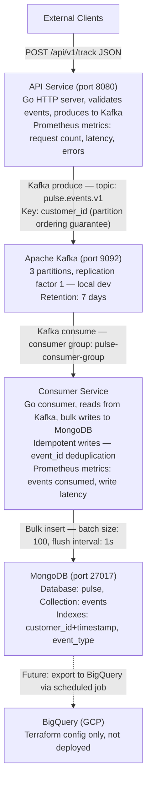
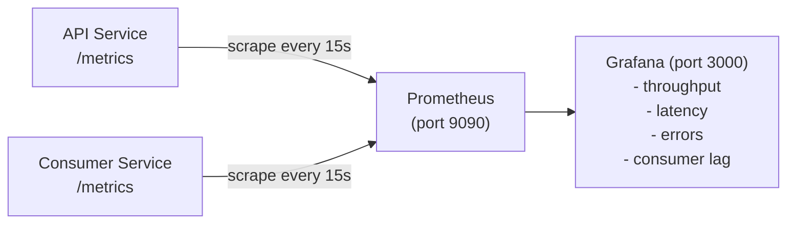

# Project Specification — Pulse Pipeline

## Vision

Build a simplified real-time event tracking pipeline as a hands-on learning project for Go, Kafka, MongoDB, and GCP infrastructure — not production readiness.

**This project exists to demonstrate:**
1. Understanding of distributed event streaming systems
2. Practical Go programming (concurrency, error handling, graceful shutdown)
3. Kafka producer/consumer patterns (topics, partitions, consumer groups, idempotency)
4. MongoDB operations at write-heavy workloads (bulk writes, indexing, deduplication)
5. Observability (Prometheus metrics, Grafana dashboards)
6. GCP infrastructure design via Terraform (configuration only, not deployed)

---

## Architecture

### Data Flow



### Observability



---

## Component Specification

### 1. API Service (`services/api/`)

**Purpose:** Accept HTTP tracking events, validate them, and produce to Kafka.

**Endpoints:**

| Method | Path | Description |
|---|---|---|
| `POST` | `/api/v1/track` | Accept a single tracking event |
| `POST` | `/api/v1/track/batch` | Accept a batch of events (max 100) |
| `GET` | `/health` | Health check (Kafka connectivity) |
| `GET` | `/metrics` | Prometheus metrics endpoint |

**Event Schema (JSON):**

```json
{
  "event_id": "evt_abc123",          // Optional — generated if missing (UUID v4)
  "customer_id": "user-456",         // Required — partition key
  "event_type": "page_view",         // Required — enum: page_view, click, purchase, add_to_cart, search, custom
  "timestamp": "2026-03-20T10:30:00Z", // Optional — server time if missing (RFC3339)
  "properties": {                    // Optional — arbitrary key-value pairs
    "page": "/products/winter-jacket",
    "referrer": "google.com",
    "price": 89.99
  },
  "context": {                       // Optional — device/session metadata
    "device": "mobile",
    "session_id": "sess-789",
    "ip": "192.168.1.1",
    "user_agent": "Mozilla/5.0..."
  }
}
```

**Validation rules:**
- `customer_id`: required, non-empty string, max 256 chars
- `event_type`: required, must be one of the allowed types
- `properties`: optional, max 50 keys, values must be string/number/boolean
- `context`: optional, all fields optional
- Total payload: max 64KB

**Response:**

```json
// Success (202 Accepted)
{ "status": "accepted", "event_id": "evt_abc123" }

// Batch success (202 Accepted)
{ "status": "accepted", "count": 5, "event_ids": ["evt_1", "evt_2", ...] }

// Validation error (400 Bad Request)
{ "status": "error", "message": "customer_id is required" }

// Server error (500 Internal Server Error)
{ "status": "error", "message": "failed to produce to Kafka" }
```

**Prometheus metrics:**

| Metric | Type | Labels | Description |
|---|---|---|---|
| `pulse_api_requests_total` | Counter | method, path, status | Total HTTP requests |
| `pulse_api_request_duration_seconds` | Histogram | method, path | Request latency |
| `pulse_api_events_produced_total` | Counter | event_type | Events sent to Kafka |
| `pulse_api_events_validation_failed_total` | Counter | reason | Validation failures |
| `pulse_api_kafka_produce_errors_total` | Counter | | Kafka produce failures |

**Key implementation details:**
- Use `net/http` standard library (no framework)
- Graceful shutdown: listen for SIGINT/SIGTERM, drain HTTP connections, flush Kafka producer
- Kafka producer: sync mode with `acks=all` (learning project, simplicity over throughput)
- Request ID middleware: generate UUID, pass via context, include in logs
- Structured logging: `log/slog` with JSON output
- Panic recovery middleware: catch panics, return 500, log stack trace

---

### 2. Consumer Service (`services/consumer/`)

**Purpose:** Read events from Kafka, batch them, and bulk write to MongoDB with idempotency.

**Consumer loop:**

```
1. Poll Kafka for messages (consumer group: pulse-consumer-group)
2. Accumulate messages in buffer
3. When buffer hits 100 messages OR 1 second has passed:
   a. Bulk write to MongoDB (unordered, with upsert for deduplication)
   b. Commit Kafka offsets
4. On shutdown: flush remaining buffer, commit final offsets
```

**Idempotency strategy:**
- Each event has a unique `event_id`
- MongoDB upsert: `updateOne({ event_id: X }, { $setOnInsert: event }, { upsert: true })`
- This means: if event_id already exists, skip. If not, insert.
- This handles Kafka at-least-once delivery (duplicates are safe)

**Prometheus metrics:**

| Metric | Type | Labels | Description |
|---|---|---|---|
| `pulse_consumer_events_consumed_total` | Counter | event_type | Events read from Kafka |
| `pulse_consumer_events_written_total` | Counter | | Events written to MongoDB |
| `pulse_consumer_events_deduplicated_total` | Counter | | Duplicates skipped |
| `pulse_consumer_batch_write_duration_seconds` | Histogram | | MongoDB bulk write latency |
| `pulse_consumer_kafka_lag` | Gauge | partition | Consumer lag per partition |
| `pulse_consumer_buffer_size` | Gauge | | Current buffer size |

**Key implementation details:**
- Use `confluent-kafka-go` (or `segmentio/kafka-go` — decide during implementation)
- Graceful shutdown: stop consuming, flush buffer, commit offsets, close MongoDB
- Error handling: if MongoDB write fails, do NOT commit Kafka offsets (retry on next poll)
- Dead Letter Queue (DLQ): events that fail validation or cause errors after 3 retries go to `pulse.events.dlq.v1` topic
- Structured logging with slog

---

### 3. MongoDB Schema

**Database:** `pulse`
**Collection:** `events`

**Document structure:**

```json
{
  "_id": ObjectId("..."),            // Auto-generated
  "event_id": "evt_abc123",          // Unique, indexed (deduplication key)
  "customer_id": "user-456",         // Indexed (query by customer)
  "event_type": "page_view",         // Indexed (query by type)
  "timestamp": ISODate("2026-..."),  // Indexed (time-range queries)
  "properties": { ... },             // Flexible schema
  "context": { ... },                // Device/session metadata
  "received_at": ISODate("2026-..."),// When API received the event
  "processed_at": ISODate("2026-...") // When consumer wrote to MongoDB
}
```

**Indexes:**

```javascript
// Deduplication (unique)
db.events.createIndex({ "event_id": 1 }, { unique: true })

// Customer timeline queries
db.events.createIndex({ "customer_id": 1, "timestamp": -1 })

// Event type filtering
db.events.createIndex({ "event_type": 1, "timestamp": -1 })

// TTL — auto-delete events older than 30 days (optional, for learning)
db.events.createIndex({ "timestamp": 1 }, { expireAfterSeconds: 2592000 })
```

---

### 4. Kafka Topic Design

**Topic: `pulse.events.v1`**

| Setting | Value | Rationale |
|---|---|---|
| Partitions | 3 | Learning project — enough for parallelism demo |
| Replication Factor | 1 | Local dev only (no broker redundancy needed) |
| Retention | 7 days | Long enough for replay experiments |
| Cleanup Policy | delete | Standard log compaction not needed |
| Key | `customer_id` | All events for same customer go to same partition (ordering) |
| Value | JSON (event payload) | Human-readable for learning/debugging |

**Topic: `pulse.events.dlq.v1`** (Dead Letter Queue)

| Setting | Value |
|---|---|
| Partitions | 1 |
| Retention | 30 days |

---

### 5. Observability

**Prometheus scrape config:**

```yaml
scrape_configs:
  - job_name: 'pulse-api'
    static_configs:
      - targets: ['api:8080']
    scrape_interval: 15s

  - job_name: 'pulse-consumer'
    static_configs:
      - targets: ['consumer:8081']
    scrape_interval: 15s
```

**Grafana Dashboard — "Pulse Pipeline Overview":**

Panels:
1. **Events/sec** — rate(pulse_api_events_produced_total[1m])
2. **API Latency p99** — histogram_quantile(0.99, pulse_api_request_duration_seconds)
3. **Consumer Lag** — pulse_consumer_kafka_lag by partition
4. **MongoDB Write Latency** — pulse_consumer_batch_write_duration_seconds
5. **Error Rate** — rate(pulse_api_kafka_produce_errors_total[5m])
6. **Events by Type** — sum by(event_type)(rate(pulse_api_events_produced_total[5m]))
7. **Buffer Size** — pulse_consumer_buffer_size
8. **DLQ Count** — pulse_consumer_events_deduplicated_total

---

### 6. Terraform — GCP Infrastructure (Config Only)

**Not deployed** — this is "how it would look in production on GCP."

**Resources defined:**

| File | Resource | GCP Service | Purpose |
|---|---|---|---|
| `gke.tf` | Kubernetes cluster | GKE | Run API + Consumer as pods |
| `bigquery.tf` | Dataset + table | BigQuery | Long-term event analytics |
| `gcs.tf` | Storage bucket | Cloud Storage | Event exports, backups |
| `monitoring.tf` | Alert policies | Cloud Monitoring | Uptime, error rate alerts |
| `networking.tf` | VPC + firewall | VPC | Network isolation |
| `variables.tf` | Input variables | — | Parameterized config |
| `outputs.tf` | Outputs | — | Cluster endpoint, bucket URL |

**GKE cluster config:**
- Region: `europe-west1` (Belgium — closest to Bratislava)
- Node pool: `e2-standard-2` (2 vCPU, 8GB RAM)
- Autoscaling: 1–3 nodes
- Workload Identity enabled

**BigQuery table schema** (mirrors MongoDB events collection):

```sql
CREATE TABLE pulse_events (
  event_id STRING NOT NULL,
  customer_id STRING NOT NULL,
  event_type STRING NOT NULL,
  timestamp TIMESTAMP NOT NULL,
  properties JSON,
  context JSON,
  received_at TIMESTAMP,
  processed_at TIMESTAMP
)
PARTITION BY DATE(timestamp)
CLUSTER BY customer_id, event_type;
```

---

## Implementation Phases

### Phase 1: Foundation 🏗️

**Goal:** Basic project structure, Docker Compose, and a working "hello world" Go service.

- [ ] Initialize Go modules for `services/api` and `services/consumer`
- [ ] Create `docker-compose.yml` with Kafka (+ Zookeeper), MongoDB, Prometheus, Grafana
- [ ] API: `GET /health` returns `{ "status": "ok" }`
- [ ] API: Structured logging with `log/slog`
- [ ] Makefile with `up`, `down`, `logs` targets
- [ ] Verify: `docker compose up -d` starts everything clean, `curl /health` works

**Acceptance:** Stack starts with one command, health endpoint responds.

---

### Phase 2: Event Ingestion 📥

**Goal:** API accepts events, validates them, and produces to Kafka.

- [ ] Event model with validation (`models/event.go`)
- [ ] `POST /api/v1/track` handler — validate, generate event_id if missing, produce to Kafka
- [ ] Kafka producer wrapper with connection management and graceful shutdown
- [ ] Validation error responses with clear messages
- [ ] Request ID middleware
- [ ] Panic recovery middleware
- [ ] Unit tests: event validation (table-driven), handler tests with mock Kafka
- [ ] Verify: send event via curl, see it in Kafka topic (use `kafka-console-consumer`)

**Acceptance:** Events flow from HTTP → Kafka. Invalid events return 400 with clear message.

---

### Phase 3: Event Processing 🔄

**Goal:** Consumer reads from Kafka and writes to MongoDB with idempotency.

- [ ] Kafka consumer wrapper with consumer group, offset management
- [ ] MongoDB bulk writer with configurable batch size and flush interval
- [ ] Idempotent upserts (event_id deduplication)
- [ ] Graceful shutdown: flush buffer → commit offsets → close connections
- [ ] DLQ for failed events (after 3 retries)
- [ ] MongoDB indexes (create on startup)
- [ ] Unit tests: bulk writer, idempotency, DLQ routing
- [ ] Verify: send events, see them in MongoDB, send duplicates — no duplicate docs

**Acceptance:** Events flow from Kafka → MongoDB. Duplicates are handled. DLQ works.

---

### Phase 4: Batch Endpoint + Load Testing 📦

**Goal:** Batch event ingestion and basic performance validation.

- [ ] `POST /api/v1/track/batch` — accept array of events (max 100)
- [ ] Load test script: send 10,000 events, measure throughput and latency
- [ ] Seed data script: generate realistic e-commerce events
- [ ] Verify: batch endpoint handles 100 events in single request, load test completes

**Acceptance:** Batch endpoint works. Load test shows >500 events/sec locally.

---

### Phase 5: Observability 📊

**Goal:** Prometheus metrics and Grafana dashboard.

- [ ] API metrics: request count, latency histogram, produce errors, validation failures
- [ ] Consumer metrics: consumed count, write latency, lag, buffer size, DLQ count
- [ ] Prometheus scrape config for both services
- [ ] Grafana dashboard JSON (provisioned automatically)
- [ ] Verify: dashboard shows live data during load test

**Acceptance:** Grafana dashboard shows all 8 panels with real data.

---

### Phase 6: GCP Infrastructure 🏗️☁️

**Goal:** Terraform configurations for GCP deployment (not deployed).

- [ ] GKE cluster with node pool and autoscaling
- [ ] BigQuery dataset with events table (partitioned + clustered)
- [ ] Cloud Storage bucket for exports
- [ ] Cloud Monitoring alert policies
- [ ] VPC and firewall rules
- [ ] Kubernetes manifests for API and Consumer deployments
- [ ] `terraform validate` passes
- [ ] Verify: `terraform plan` shows resources (with mock/dummy credentials or validate only)

**Acceptance:** All `.tf` files valid. K8s manifests reference correct Docker images.

---

### Phase 7: Polish + Documentation 📝

**Goal:** README, CI, and interview-ready presentation.

- [ ] README with architecture diagram, quick start, and project structure
- [ ] GitHub Actions CI: `go test`, `golangci-lint`, `docker build`
- [ ] CHANGELOG.md with all phases
- [ ] Architecture decision records in docs/
- [ ] Final load test results documented
- [ ] Verify: clone from scratch, `docker compose up`, `make load-test` — everything works

**Acceptance:** A stranger can clone, run, and understand the project in 10 minutes.

---

## Interview Talking Points

When discussing this project on an interview, emphasize:

1. **"I built this to learn your stack"** — proactive, shows initiative
2. **Kafka choices** — why `customer_id` as key (ordering per customer), why at-least-once + idempotency, why DLQ
3. **Go patterns** — graceful shutdown, context propagation, goroutine-safe bulk writer
4. **MongoDB at scale thinking** — bulk writes for throughput, idempotent upserts for deduplication, proper indexing strategy, TTL for data lifecycle
5. **Observability** — what metrics matter for a pipeline (throughput, latency, lag, error rate)
6. **GCP readiness** — "I didn't just learn locally, I designed how this would deploy on GCP with Terraform"
7. **Trade-offs** — "In production I'd use async Kafka producer for throughput, but for learning I chose sync for simplicity"
